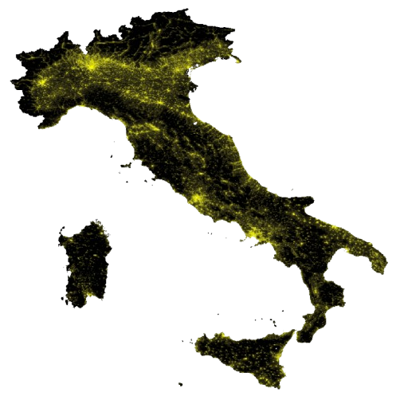
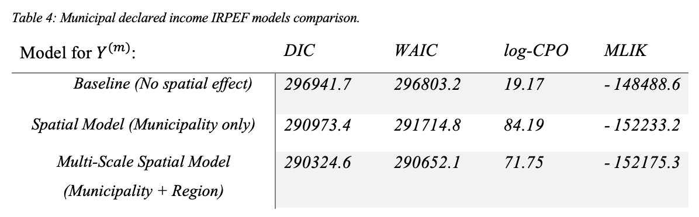
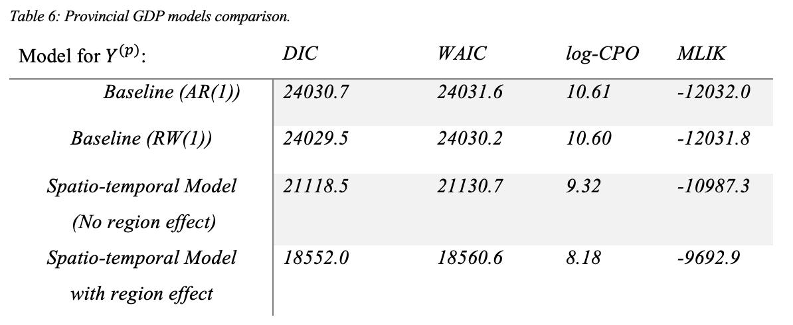
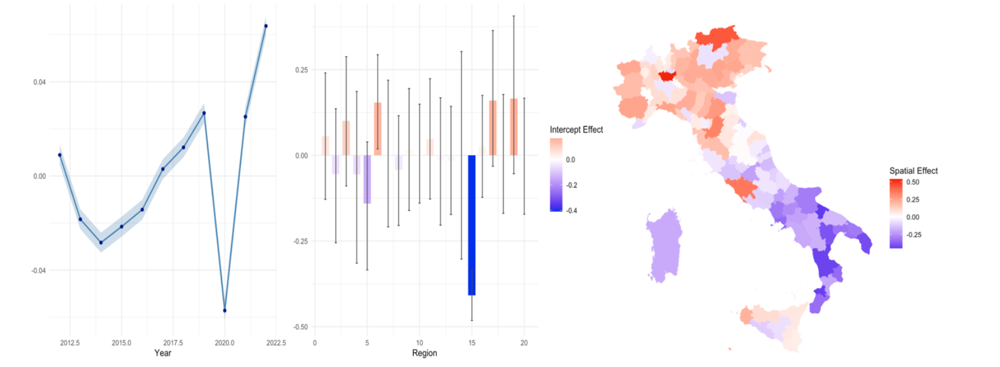

# Bayesian Spatio-Temporal Modeling of Economic Activity in Italy Using Nighttime Lights

  
   
  <em>Figure 1: NASA Black Marble VNP46A4 annual composite for Italy, 2023</em>

## 📌 Project Overview
This repository contains the complete implementation of a **Bayesian hierarchical spatio-temporal model** for estimating subnational economic activity in Italy using **NASA Black Marble nighttime lights (NTL)** data, accessed via the `blackmarbler` R package. The research demonstrates how satellite-derived luminosity can serve as an objective, high-resolution predictor for economic indicators. This study focuses in the use of spatial statistical model with the use of conditional neighbourhood areal data models. The evaluation of the linerar prediction and releated latent field process and compute the relative probability distribution we used `INLA` R package.

---

## 🎯 Objective
The primary goal is to **establish and validate nighttime lights as a reliable predictor of economic activity** across Italian administrative units. By developing Bayesian spatio-temporal models, we:

- Quantify the relationship between NTL intensity and economic measures (GDP at provincial level, declared income at municipal level).
- Capture spatial and temporal dependencies that traditional models ignore.
- Produce high-resolution economic estimates for data-scarce or unobserved regions.
- Provide uncertainty quantification for all parameters estimation and predictions.

---

## 📊 Methodology

### 1. **Data Sources**
- **Nighttime Lights:** NASA Black Marble VNP46A4 annual composites (2012–2023).
- **Economic Data:**
  - Provincial GDP (PPP-adjusted) from Kummu et al. (2025) for 1990–2022.
  - Municipal taxable income (IRPEF) from Italian Ministry of Finance (2023).
- **Spatial Neighbourhood domain and structure:** Official Italian administrative shapefiles for regions, provinces, and municipalities.

### 2. **Modeling Framework**
We employ a **Bayesian hierarchical modeling approach** with the following components:

#### **Likelihood:**
- Gamma distribution for positive, right-skewed economic data.
- Log-link function to ensure positivity and model multiplicative effects.

### 3. **Inference & Computation**
- **Algorithm:** Integrated Nested Laplace Approximation (INLA) via the `INLA` package.
- **Advantages:** Deterministic, fast, and scalable for high-dimensional latent Gaussian models.
- **Model Comparison:** WAIC, DIC, log-CPO, and marginal likelihood (MLIK).

#### **Linear Predictor:**
For **municipality-level** :

$$ log(μ_i) = \alpha + \beta_1 · NTL_i + \phi_i^{(m)} + \phi _i^{(r)} $$

  

For **province-level** (spatio-temporal):

$$ log(μ_{it}) = α + ψ_r + \beta_1· NTL_{it} + φ_i^{(p)} + δ_t $$

  

Where:
- `α`: global intercept
- `β₁`: fixed effect of NTL
- `φ`: spatial random effects (ICAR prior)
- `ψ_r`: regional random intercept
- `δ_t`: temporal random effect (RW1 prior)

### 4. **Spatio-Temporal Structures**
We considered and tested four interaction types (Knorr-Held, 2000) for the provincial model, while the municipal model uses a multi-scale spatial hierarchy.

---

## 📈 Key Results

Both economic activity present a positive relatinshipe effect and a best fitting performance with the incorporation onf the spatial random effects.

### **Municipal-Level Model**
- NTL coefficient (β₁) = 0.156 so exp(0.156) = **~16.8% increase** in expected income per unit increase in luminosity.
- Multi-scale spatial effects (municipality + region) significantly improved results (lowest WAIC/DIC).

  
   
  <em>Figure 2: Municipality-level spatial random effects (ICAR model)</em>

### **Provincial-Level Model**
- NTL coefficient (β₁) = 0.01 **~1% increase** in expectde GDP per unit increase in luminosity.
- Temporal component captured COVID-19 impact (2020 decline).
- Clear north-south spatial divide evident in structured random effects.

  
   
  <em>Figure 3: Provincial-level temporal random effects (RW(1) model), random intercept and spatial random effect (ICAR model) </em>

